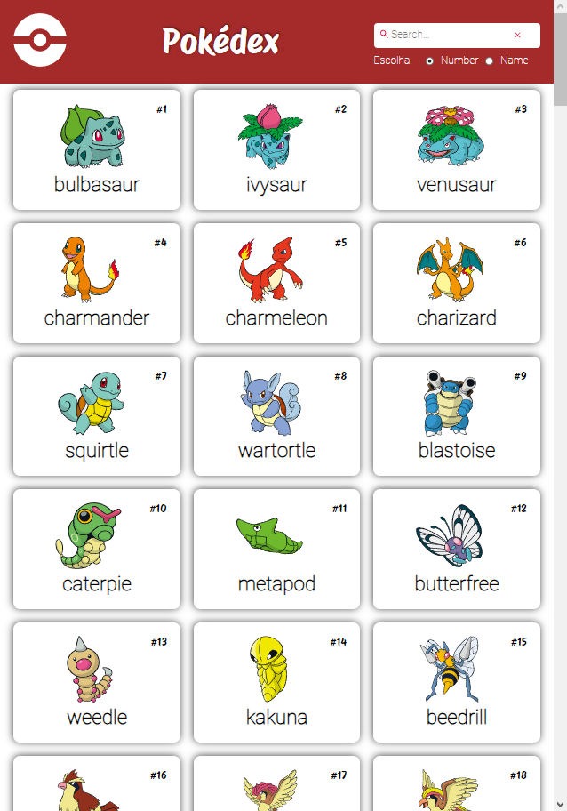
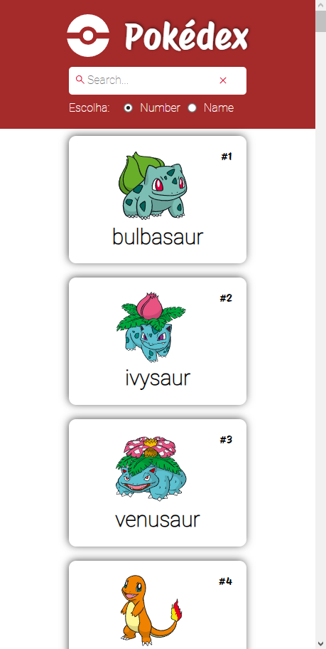

## Pokédex

### Com 151 pokemons disponiveis, pesquise por número ou nome e conheça as informações básicas disponibilizadas de cada um utilizando <a href='https://pokeapi.co' target='_blank'>PokéAPI!</a>

**Responsivo desde desktops para mobile.**

Utilizando a HTML, CSS, Sass e JavaScript, foi possivel dar forma a minha primeira pokédex. Com uma interface simples, a navegação é de fácil entendimento. 

## **Desktop:**

## **Mobile:**

